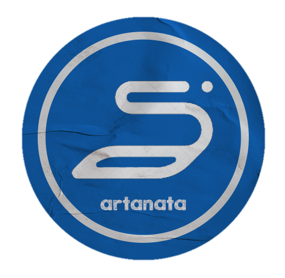

 

  
   

  
<h1>ARTANATA CHATBOT</h1>
<h5>How AI powered Chatbot can solve Accounting and Finance Efficiency</h5>

   
  <strong>Our Project List</strong>
   
  <a href="https://github.com/kroniz-utab/kotlite_algorithm" target="_blank">
      </img>
  </a>
  <a href="https://github.com/bismastr/kotliteApp" target="_blank">
      </img>
  </a>

  
<h2 style="display: inline-block">Table of Contents</h2>

  <ol>
    <li>
      <a href="#executive-summary">Executive Summary</a>
    </li>
    <li><a href="#team-members">Team Members</a></li>
    <li><a href="#our-products">Our Products</a>
    <ul>
      <li><a href="#documentation">Documentation</a></li>
    </ul>
    </li>
    <li><a href="#acknowledgements">Acknowledgements</a></li>
  </ol>

## Executive Summary

There are around 63 million MSMEs in Indonesia, 95% of which are still in the micro business sector. Many MSME actors do not understand the appropriate accounting reporting standards (SAK ETAP). We hope that we can help MSME players overcome financial reporting problems by presenting a chatbot feature in the application. The question is what is the level of penetration of Chatbot AI technology in MSME accounting records, how changes in attitudes and perceptions of existing business owners towards Chatbot technology in MSMEs and what are the challenges and opportunities for MSMEs to apply artificial intelligence technology solutions to their financial report recording.

## Team Members

|        Member        | Student ID |        Path        |       Project Role        |                                                  Contacts                                                  |
| :------------------: | :--------: | :----------------: | :-----------------------: | :--------------------------------------------------------------------------------------------------------: |
|  Mitha Aurellita W.  |  A0040193  | Mobile Development |     Mobile Developer      |     [![mitha-linkedin][linkedin-shield]][mitha-linkedin-url][![mitha-github][github-shield]][mitha-github-url]     |
|  Riska Puspitasari   |  A1411698  | Mobile Development |     Mobile Developer      |     [![riska-linkedin][linkedin-shield]][riska-linkedin-url][![riska-github][github-shield]][riska-github-url]     |
|  M. Aulia Daniswara  |  C0040172  |  Cloud Computing   |          DevOps           | [![danis-linkedin][linkedin-shield]][danis-linkedin-url][![danis-github][github-shield]][danis-github-url] |
|    David Laksmana    |  C0040289  |  Cloud Computing   |          DevOps           | [![david-linkedin][linkedin-shield]][david-linkedin-url][![david-github][github-shield]][david-github-url] |
|  Ika Puteri Nur A.   |  M0040188  |  Machine Learning  | Machine Learning Engineer | [![ika-linkedin][linkedin-shield]][ika-linkedin-url][![ika-github][github-shield]][ika-github-url] |
| Al Fatoni Nugroho P. |  M0040186  |  Machine Learning  | Machine Learning Engineer |     [![alfa-linkedin][linkedin-shield]][alfa-linkedin-url][![alfa-github][github-shield]][alfa-github-url]     |

<!-- LinkedIn Link -->

[linkedin-shield]: https://img.shields.io/badge/LinkedIn--blue?style=social&logo=Linkedin
[mitha-linkedin-url]: https://www.linkedin.com/in/mitha-aurellita-wulandari-80680a205/
[riska-linkedin-url]: https://www.linkedin.com/in/riska-puspitasari-808b28197/
[danis-linkedin-url]: https://www.linkedin.com/in/auliadaniswara/
[david-linkedin-url]: https://www.linkedin.com/in/david-laksmana-599017207/
[ika-linkedin-url]: https://www.linkedin.com/in/ikaputerinurazizah/
[alfa-linkedin-url]: https://www.linkedin.com/in/al-fatoni-nugroho-putra-733528113/

<!-- Github Link -->

[github-shield]: https://img.shields.io/badge/GitHub--blue?style=social&logo=Github
[mitha-github-url]: https://github.com/MithaAurellitaWulandari
[riska-github-url]: https://github.com/riskapuspitasari
[danis-github-url]: https://github.com/mauliaaaaad
[david-github-url]: https://github.com/cluster777
[ika-github-url]: https://github.com/IkaPuteriNurAzizah
[alfa-github-url]: https://github.com/AlFatoniNugrohoPutra

<!-- ### Android Apps -->

<!-- 

  </img>&nbsp; &nbsp;&nbsp; &nbsp;

 -->

### Documentations

Soon

## Features of This Projects

- Company Data
- Artanata Chatbot
- Financial Report
- View Report

## Present By

  </img>&nbsp; &nbsp;

